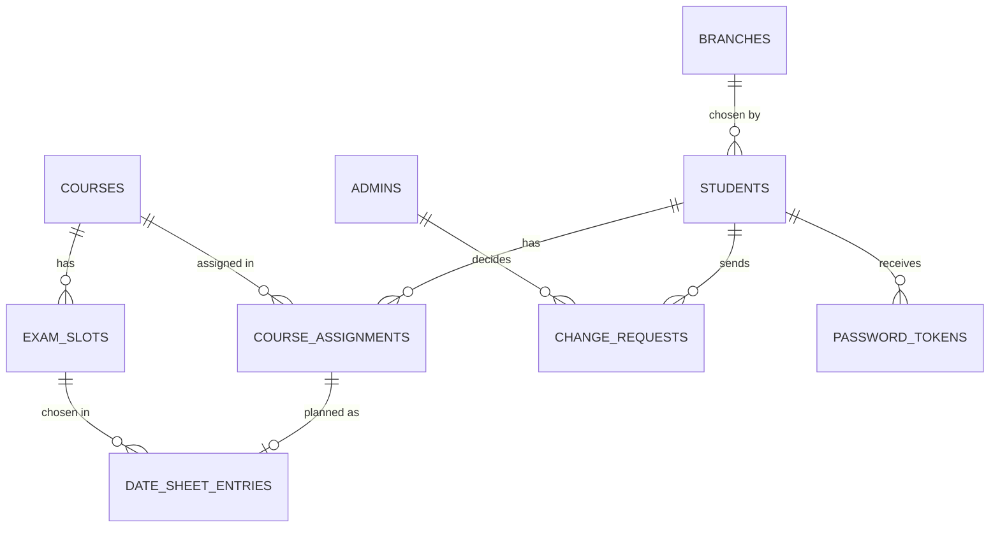

# examslot
# ExamSlot

**Plan your own exam date sheet, within fair rules.**

ExamSlot is a web app for a university with several campuses (branches). Instead of handing every student a fixed exam timetable, the university lets each student build their own: they choose the campus where they will sit their papers, then pick one exam time for each course from the times the exam office has opened.

Built for the **Loopverse 3.0** hackathon.

## Development team

| Name | Role |
|---|---|
| Sajjad Zaidi | Developer |
| Wasiq Azeem | Developer |
| Emshal | Developer |

## How the project is built

ExamSlot has three parts that talk to each other:

```
 Browser (website)          Server (API)              Database
 React + Vite   ───────►    FastAPI (Python)  ───────► PostgreSQL
 shows the pages            checks every rule          stores everything and
 and sends requests         and answers in JSON        blocks bad data itself
                                  │
                                  └──► Resend (sends emails)
```

- The **website** only shows screens and sends requests. It never decides anything important.
- The **server** checks every rule before saving anything.
- The **database** has its own rules too (for example "no overlapping exams"), so even a bug in the server cannot save bad data.

## Website pages (frontend routes)

Open them at `http://localhost:5173` followed by the path.

### Public pages (no sign-in)

| Path | What it does |
|---|---|
| `/login` | Student sign-in with email and password. Students cannot register themselves. |
| `/admin/login` | Admin (exam office) sign-in. |
| `/forgot-password` | Student enters their email to get a reset link. |
| `/set-password` | Opened from the email link. The student sets a password. The link works only once and expires. |

### Student pages (student must be signed in)

| Path | What it does |
|---|---|
| `/student/branch` | Choose the exam campus. Shown only once, on first sign-in. |
| `/student` | Dashboard: the student's full details (read only), then the planner, where they pick one exam time per course. Clashes are shown with a suggested alternative. |
| `/student/date-sheet` | The saved date sheet, sorted by date, with Print and Download PDF. |
| `/student/help` | Need help: ask to change the campus or the date sheet, and see the status and the admin's remark. |

### Admin pages (admin must be signed in)

| Path | What it does |
|---|---|
| `/admin` | Dashboard with counts (students, pending requests, saved date sheets). |
| `/admin/students` | List of students with search and pages. Create, edit, deactivate or delete students. |
| `/admin/assignments` | Give each student 4 to 6 courses. |
| `/admin/slots` | Create, edit and delete exam times for each course. |
| `/admin/requests` | See students' requests and approve or reject them with a remark. |
| `/admin/branches` | Manage campuses. |
| `/admin/courses` | Manage courses. |

## Server routes (backend API)

All API routes start with `http://localhost:8000/api/v1`. Student routes only accept a student sign-in token, and admin routes only accept an admin token, so a student can never reach admin data.

### Health

| Method and path | What it does |
|---|---|
| `GET /health` | Says the server is running. |
| `GET /health/ready` | Says the server can reach the database. |

### Sign-in and passwords

| Method and path | What it does | Rule it protects |
|---|---|---|
| `POST /auth/student/login` | Student signs in, gets a token. | Same error for wrong email or wrong password, so nobody can guess which emails exist. After 5 wrong tries the account locks for 15 minutes. |
| `POST /auth/admin/login` | Admin signs in, gets a token. | Admin tokens work only on admin routes. |
| `POST /auth/student/logout`, `POST /auth/admin/logout` | Signs out everywhere. | Old tokens stop working at once. |
| `POST /auth/password/forgot` | Sends a reset link if the email exists. | Always gives the same answer. |
| `POST /auth/password/verify-link` | Checks a link before showing the form. | Used, expired or replaced links are refused. |
| `POST /auth/password/set` | Sets the password from the link. | The link works once. Passwords are stored only as secure hashes, never as plain text. |

### Student routes

| Method and path | What it does | Rule it protects |
|---|---|---|
| `GET /student/me` | The student's own details and progress. | A student only ever sees their own data. |
| `GET /student/branches` | Campuses the student can choose. | Only active campuses with free seats. |
| `PUT /student/branch` | Saves the campus. | Allowed once; a second try is refused unless an admin approved a change. |
| `GET /student/planner` | Courses with their available exam times. | Only times the admin created for that course, in the future, with seats left. |
| `PUT /student/date-sheet` | Saves all exam choices at once. | Every course needs a time; no two exams may overlap; seats must be free; saving works once. |
| `GET /student/date-sheet` | The saved date sheet. | |
| `GET /student/date-sheet/pdf` | The date sheet as a PDF file. | |
| `GET /student/requests`, `POST /student/requests` | List and send change requests. | Only one waiting request of each type. |

### Admin routes

| Method and path | What it does | Rule it protects |
|---|---|---|
| `GET /admin/dashboard` | Counts and chart data. | |
| `GET, POST /admin/branches` and `GET, PATCH, DELETE /admin/branches/{id}` | List, add, view, edit, delete campuses. | A campus already chosen by students cannot be deleted; it can be set inactive. |
| `GET, POST /admin/courses` and `GET, PATCH, DELETE /admin/courses/{id}` | Same for courses. | Unique course code. A course in use cannot be deleted. |
| `GET, POST /admin/students` and `GET, PATCH, DELETE /admin/students/{id}` | List, add, view, edit, delete students. Adding a student sends the setup email. | Unique email, registration number and CNIC. Delete needs the registration number typed as confirmation. |
| `POST /admin/students/{id}/setup-email` | Sends the setup email again. | The old link stops working. |
| `GET /admin/assignments`, `PUT /admin/students/{id}/assignments` | List and set a student's courses. | Between 4 and 6 courses, no duplicates; locked after the student saves, unless a date sheet change was approved. |
| `GET, POST /admin/slots` and `GET, PATCH, DELETE /admin/slots/{id}` | List, add, edit, delete exam times. | No times in the past, no duplicates, end after start. A time already chosen by students cannot be deleted or moved. |
| `GET /admin/requests`, `POST /admin/requests/{id}/approve`, `POST /admin/requests/{id}/reject` | Review requests. | A request can be decided once. An approval lets the student make that change exactly once. |

Every admin list supports search and pages on the server (`?q=`, `?page=`, `?page_size=`), so only one page of data is sent at a time.

## The rules in one place

| Rule | Where it is enforced |
|---|---|
| 4 to 6 courses per student | Server and database |
| Campus chosen once | Server and database |
| Date sheet saved once | Server and database |
| No overlapping exams | Website warns, server checks, database blocks |
| Only exam times made for that course | Server and database |
| Approval reopens an action once | Server and database |
| One waiting request per type | Server and database |
| Seats per exam time and campus | Server |
| Students see only their own data | Server |
| Unique email, registration number, campus code, course code | Database |

## Run it on your computer

You need Docker Desktop, Python 3.12 and Node.js.

**1. Database**

```bash
docker compose up -d db
```

**2. Server** (new terminal)

```bash
cd backend
python3.12 -m venv .venv
source .venv/bin/activate
pip install -r requirements-dev.txt
alembic upgrade head
python -m app.cli seed-demo
uvicorn app.main:create_app --factory --reload --port 8000
```

**3. Website** (another terminal)

```bash
cd frontend
npm install
npm run dev
```

**4.** Open `http://localhost:5173`.

## Demo accounts (local)

| Account | Sign-in page | Email | Password |
|---|---|---|---|
| Admin | `/admin/login` | `local-inbox+admin@example.com` | `local-demo-admin-password` |
| Student | `/login` | `local-inbox+ayesha.siddiqui@example.com` | `local-demo-student-password` |

These come from the `SEED_*` values in `backend/.env`.

## Database diagram



## Assumptions we made

- All dates and times are Pakistan time.
- An exam with no end time counts as 3 hours long when checking for clashes.
- A campus change after saving keeps the same exam times.
- Admin accounts are created only from the server command line.
- All demo data is invented.

## Run the tests

```bash
cd backend && source .venv/bin/activate && pytest -q
cd frontend && npm test -- --run
```
